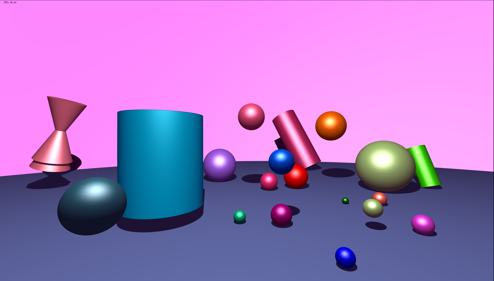

# miniRT — CPU Ray Tracer

> A physically-based ray tracer written in C, built from scratch as part of the 42 school curriculum.
> Renders complex 3D scenes entirely on the CPU, with a full cinematic pipeline including real-time multi-frame playback, looping sequences, and aggressive performance optimizations.

---

## Table of Contents

- [Overview](#overview)
- [Features](#features)
- [Architecture & Rendering Pipeline](#architecture--rendering-pipeline)
- [Optimizations](#optimizations)
- [Scene Format](#scene-format)
- [Build & Usage](#build--usage)
- [Gallery](#gallery)
- [Cinematics](#cinematics)
- [Credits](#credits)

---

## Overview

**miniRT** is a ray tracer implemented in C, leveraging the **MiniLibX** — the 42 school's lightweight X11 graphics library — for window management and pixel-level framebuffer access. The renderer supports a declarative scene description format, real-time display, and a multi-frame cinematic system capable of playing back and looping complex animated sequences directly on screen.

The project covers the full breadth of a production ray-tracing pipeline: scene parsing and validation, ray–geometry intersection, shading and lighting models, camera simulation, and a suite of optimizations targeting both algorithmic complexity and low-level CPU cache efficiency.

---

## Features

### Core Ray Tracing

- **Primitive intersection**: analytically exact ray–sphere, ray–plane, ray–cylinder, and ray–cone intersection routines.
- **Phong reflectance model**: ambient, diffuse (Lambertian), and specular (Phong) components with configurable material properties.
- **Hard shadows**: shadow rays cast toward each light source.
- **Point lights and ambient lighting**: support for multiple and colored light sources in a single scene.
- **Camera model**: configurable field of view, position, and orientation vector, projecting rays through a virtual image plane.

### Texturing & Surface Detail

- **Diffuse texture mapping**: UV-mapped image textures applied to primitives, driving per-pixel albedo lookups.
- **Bump mapping**: tangent-space normal maps perturbing the surface normal at each intersection point, producing high-frequency geometric detail at zero geometric cost. The tangent and bitangent basis vectors are computed analytically per primitive.

### Anti-Aliasing

- **Stochastic supersampling (SSAA)**: multiple rays are cast per pixel with sub-pixel jittered offsets, suppressing jagged edges. The sample count is configurable per scene via the `AA` directive.

### Multi-Frame Rendering for Cinematics

Frames are defined sequentially within a single `.rt` file, separated by frame delimiters. At launch, the renderer plays back the sequence in real time at the target framerate specified in the scene. A loop-back directive allows any frame to jump back to a previous point in the sequence — enabling seamless looping animations without duplicating frame data. This makes the `.rt` format entirely self-contained: scene geometry, lighting, camera motion, timing, and playback control are all encoded in one file.

---

## Architecture & Rendering Pipeline

```
Scene file (.rt)
      |
      v
 [Parser & Validator]
      |
      v
 [Scene Graph]  ──>  Primitives, Lights, Materials, Camera
      |
      v
 [Build Acceleration Structures] ──> precompute bounding boxes and BVH
      |
      v
 [Tile Dispatcher]  ──>  divides the framebuffer into NxN tiles
      |
      v
 [Init Thread Pool]  ──>  each worker thread processes an independent tile
      |
      v
 [Primary Ray Generation]  ──>  per-pixel, per-sample (SSAA)
      |
      v
 [BVH Traversal]  ──>  AABB hierarchy culling
      |
      v
 [Intersection & Shading]
      |
      v
 [Framebuffer Accumulation]
      |
      v
 [Final Image Rendering]  ──>  timed blit at target FPS / advance to next frame
```

The renderer follows a classic **backward ray tracing** (eye-to-light) approach. Each thread operates on a spatially coherent tile of the image, minimizing inter-thread cache interference and maximizing DRAM locality.

---

## Optimizations

This section documents the performance engineering work that brings the renderer from a naive brute-force traversal to a practical real-time pipeline.

### Multithreading

The framebuffer is partitioned into fixed-size tiles. A thread pool — sized to the number of logical CPU cores via `sysconf(_SC_NPROCESSORS_ONLN)` — dispatches tiles through a shared work queue protected by a mutex. Each worker thread independently processes its assigned tile with no synchronization required during shading, enabling near-linear scaling with core count.

### Framebuffering

Rather than blitting individual pixels to the MiniLibX window on each write (which would trigger a system call per pixel), all shading results are accumulated into an off-screen **framebuffer** (a contiguous `uint32_t` array). Once a frame is fully resolved, a single `mlx_put_image_to_window` call transfers the entire buffer to the display. This approach amortizes X11 IPC overhead and decouples the rendering rate from the display refresh.

### Bounding Volume Hierarchy (BVH) with AABB

Naive ray tracing tests every ray against every primitive in the scene — O(N) per ray. To reduce this to O(log N), the scene geometry is organized into a **Bounding Volume Hierarchy**: a binary tree where each node stores an **Axis-Aligned Bounding Box (AABB)** tightly enclosing its subtree. Ray traversal descends the tree, pruning entire subtrees when the ray misses a node's AABB. AABB intersection is a highly optimized slab test reducible to a handful of comparisons and reciprocal multiplications, making it extremely cheap relative to full primitive intersection.

The BVH is constructed once at scene load time using the **Surface Area Heuristic (SAH)**, which minimizes the expected ray traversal cost by choosing split axes and positions that balance subtree surface areas — producing significantly tighter trees than median-split strategies on non-uniform geometry distributions.

### Cache-Optimized Memory Layout

Ray traversal is one of the most cache-sensitive workloads in computer graphics. The following layout decisions were made to maximize **L1/L2 cache hit rates**:

- **Hot/cold data separation**: fields accessed during BVH traversal (AABB min/max extents, child pointers) are packed into a dedicated, contiguous BVH node array, separate from the full primitive data. A cache line loaded during traversal contains only traversal-relevant data — texture pointers and material properties are not fetched until a leaf is actually reached.
- **Struct field ordering to eliminate implicit padding**: all performance-critical structures have their fields ordered by decreasing size, ensuring the compiler emits no padding bytes between members. This keeps each structure as compact as possible, maximizing the number of objects that fit within a cache line and reducing the total memory footprint of the hot traversal data.
- **Contiguous primitive buffer**: all primitives, regardless of type, are stored in a single flat array. Rather than scattering objects across separate per-type lists with independent heap allocations, packing everything into one contiguous buffer improves spatial locality during intersection tests and reduces pointer-chasing overhead.

These micro-architectural optimizations collectively reduce cache miss penalties during the inner traversal loop, which is the dominant bottleneck in complex scenes.

### Arena Allocator

All scene data is managed through a custom **arena allocator**. Rather than scattering allocations across the heap with individual `malloc` calls — each carrying bookkeeping overhead and potentially fragmenting memory — the arena issues a single large upfront allocation that covers the entire scene's memory budget. Subsequent allocations are served by bumping a pointer within that block, making them effectively free at runtime.

Each worker thread holds its own private arena for its working data, ensuring that per-thread allocations are spatially isolated in memory. This eliminates false sharing: two threads cannot inadvertently land their data on the same cache line, which would otherwise cause the CPU to invalidate and reload that line on every cross-thread write — a silent but significant source of contention in multithreaded renderers.

The practical consequence is that from the moment rendering begins, the allocator is never called. The hot path — ray traversal, intersection, shading — operates entirely on memory that was laid out at scene load time, with no allocator overhead and no risk of heap fragmentation affecting cache line placement. The bulk of the arena is reserved for the primitive buffer; if that limit is exceeded at parse time, the renderer exits early rather than degrading into unpredictable reallocations mid-scene.

---

## Scene Format

Scenes are described in `.rt` files with a simple declarative syntax. A single file can encode both a static scene and a full multi-frame cinematic sequence.

### Global directives

```
# Target playback framerate
FPS 30

# Anti-aliasing sample count (rays per pixel)
AA 16

# Background: sky gradient enabled by default, BG OFF disables it (solid black)
BG OFF
```

### Primitives & lighting

```
# Camera: position  orientation  fov
C  0,0,-5    0,0,1    70

# Ambient light: intensity  color
A  0.2  255,255,255

# Point light: position  intensity  color
L  0,5,-2  0.8  255,255,255

# Sphere: center  diameter  color
sp  0,0,3    2    255,0,0

# Plane: point  normal  color
pl  0,-1,0   0,1,0   180,180,180

# Cylinder: center  axis  diameter  height  color
cy  0,0,3    0,1,0    1    3    0,0,255

# Cone: apex  axis  diameter  height  color
co  0,3,3    0,-1,0   1    3    0,255,0
```

Textures and bump maps are appended as optional fields on the relevant primitive line.

### Multi-frame & cinematic syntax

Frames are defined sequentially in the same file. Each frame is a complete, self-contained scene state.

```
# --- Frame 1 ---
C  0,0,-5    0,0,1    70
A  0.2  255,255,255
sp  0,0,3    2    255,0,0

# Frame separator: one or more '=' characters
===

# --- Frame 2 ---
C  1,0,-5    0,0,1    70
A  0.2  255,255,255
sp  0.5,0,3    2    255,0,0

===

# --- Frame 3 (loops back to frame 1) ---
C  2,0,-5    0,0,1    70
A  0.2  255,255,255
sp  1,0,3    2    255,0,0

# Loop-back directive: one or more '^' characters
# Jumps back to the frame immediately following the previous '^',
# or to frame 1 if no previous '^' exists.
^^^
```

The number of `=` or `^` characters is not significant — one is sufficient, any count is valid. The `^` directive carries no frame data of its own: it is a pure runtime playback instruction, redirecting the renderer back to the target frame without duplicating scene content.

---

## Build & Usage

### Prerequisites

- Linux (X11)
- GCC or Clang with C99 support
- GNU Make
- Git

### Compilation

The project is split into two targets following the 42 school project structure:

```bash
# Mandatory part — core ray tracing (primitives, lighting, shadows)
make

# Bonus part — full feature set (textures, bump mapping, SSAA, BVH,
#              multithreading, cinematic system, ...)
make bonus
```

### Running a scene

```bash
# Mandatory
./miniRT scenes/example.rt

# Bonus
./miniRT_bonus scenes/example.rt
```

The renderer will play back all frames defined in the file at the configured FPS, looping where `^` directives are present.

---

## Gallery




---

## Cinematics

### Animated preview (GIF)


---

## Credits

Built as part of the [42 school](https://42.fr) common core.

---

---

# miniRT — Ray Tracer CPU

> Un ray tracer à base physique écrit en C, développé from scratch dans le cadre du cursus de l'école 42.
> Rendu de scènes 3D complexes entièrement sur CPU, avec un pipeline cinématique complet incluant la lecture multi-image en temps réel, les boucles de séquences, et des optimisations de performance poussées.

---

## Table des matières

- [Vue d'ensemble](#vue-densemble)
- [Fonctionnalités](#fonctionnalités)
- [Architecture & Pipeline de rendu](#architecture--pipeline-de-rendu)
- [Optimisations](#optimisations-1)
- [Format de scène](#format-de-scène)
- [Compilation & Utilisation](#compilation--utilisation)
- [Galerie](#galerie)
- [Cinématiques](#cinématiques)
- [Crédits](#crédits)

---

## Vue d'ensemble

**miniRT** est un ray tracer implémenté en C, s'appuyant sur la **MiniLibX** — la bibliothèque graphique légère X11 de l'école 42 — pour la gestion des fenêtres et l'accès pixel par pixel au framebuffer. Le moteur supporte un format de description de scène déclaratif, un affichage temps réel, et un système multi-image capable de lire et de boucler des séquences animées complexes directement à l'écran.

Le projet couvre l'intégralité d'un pipeline de ray tracing de production : parsing et validation de scène, intersection rayon-géométrie, modèles d'éclairage et de shading, simulation de caméra, et un ensemble d'optimisations ciblant à la fois la complexité algorithmique et l'efficacité du cache CPU.

---

## Fonctionnalités

### Ray Tracing de base

- **Intersection de primitives** : routines analytiquement exactes pour les intersections rayon-sphère, rayon-plan, rayon-cylindre et rayon-cône.
- **Modèle de réflectance de Phong** : composantes ambiante, diffuse (Lambertienne) et spéculaire (Phong) avec des propriétés de matériaux configurables.
- **Ombres dures** : rayons d'ombre projetés vers chaque source lumineuse.
- **Lumières ponctuelles et éclairage ambiant** : support de plusieurs sources lumineuses colorées par scène.
- **Modèle de caméra** : champ de vision, position et vecteur d'orientation configurables, projetant les rayons à travers un plan image virtuel.

### Texturage & Détail de surface

- **Texture mapping diffus** : textures image UV-mappées appliquées aux primitives, pilotant les lookups d'albédo par pixel.
- **Bump mapping** : les normales de l'espace tangent perturbent la normale de surface à chaque point d'intersection, produisant un détail géométrique haute fréquence à coût géométrique nul. Les vecteurs de base tangente et bitangente sont calculés analytiquement par primitive.

### Anti-Aliasing

- **Supersampling stochastique (SSAA)** : plusieurs rayons sont lancés par pixel avec des décalages sous-pixel jittérisés, supprimant les artefacts d'aliasing. Le nombre de samples est configurable par scène via la directive `AA`.

### Rendu multi-image pour cinématiques

Les frames sont définies séquentiellement dans un seul fichier `.rt`, séparées par des délimiteurs de frame. Au lancement, le moteur lit la séquence en temps réel au framerate cible spécifié dans la scène. Une directive de loop-back permet à n'importe quelle frame de revenir à un point antérieur dans la séquence — permettant des animations en boucle sans duplication de données. Le format `.rt` est ainsi entièrement auto-contenu : géométrie de scène, éclairage, mouvement de caméra, timing et contrôle de lecture sont tous encodés dans un seul fichier.

---

## Architecture & Pipeline de rendu

```
Fichier de scène (.rt)
      |
      v
 [Parser & Validateur]
      |
      v
 [Graphe de scène]  ──>  Primitives, Lumières, Matériaux, Caméra
      |
      v
 [Construction des structures d'accélération] ──> précalcul AABB et BVH
      |
      v
 [Tile Dispatcher]  ──>  divise le framebuffer en tuiles NxN
      |
      v
 [Init Thread Pool]  ──>  chaque thread worker traite une tuile indépendante
      |
      v
 [Génération de rayons primaires]  ──>  par pixel, par sample (SSAA)
      |
      v
 [Traversée BVH]  ──>  élagage par hiérarchie AABB
      |
      v
 [Intersection & Shading]
      |
      v
 [Accumulation framebuffer]
      |
      v
 [Rendu image finale]  ──>  blit cadencé au FPS cible / passage à la frame suivante
```

Le moteur suit une approche classique de **ray tracing inverse** (oeil-vers-lumière). Chaque thread opère sur une tuile spatialement cohérente de l'image, minimisant les interférences de cache inter-threads et maximisant la localité DRAM.

---

## Optimisations

Cette section documente le travail d'ingénierie performance qui fait passer le moteur d'un parcours naïf brute-force à un pipeline temps réel pratique.

### Multithreading

Le framebuffer est partitionné en tuiles de taille fixe. Un thread pool — dimensionné au nombre de coeurs logiques via `sysconf(_SC_NPROCESSORS_ONLN)` — distribue les tuiles via une file de travail partagée protégée par un mutex. Chaque thread worker traite indépendamment sa tuile assignée sans synchronisation requise pendant le shading, permettant une mise à l'échelle quasi-linéaire avec le nombre de coeurs.

### Framebuffering

Plutôt que de blitter les pixels individuels vers la fenêtre MiniLibX à chaque écriture (ce qui déclencherait un appel système par pixel), tous les résultats de shading sont accumulés dans un **framebuffer hors-écran** (un tableau `uint32_t` contigu). Une fois une frame entièrement résolue, un unique appel `mlx_put_image_to_window` transfère l'intégralité du buffer vers l'affichage. Cette approche amortit le coût IPC X11 et découple le taux de rendu du rafraîchissement de l'écran.

### Bounding Volume Hierarchy (BVH) avec AABB

Le ray tracing naïf teste chaque rayon contre chaque primitive de la scène — O(N) par rayon. Pour réduire cela à O(log N), la géométrie de la scène est organisée en une **Bounding Volume Hierarchy** : un arbre binaire où chaque noeud stocke une **Axis-Aligned Bounding Box (AABB)** englobant étroitement son sous-arbre. La traversée de rayon descend l'arbre, élagant des sous-arbres entiers lorsque le rayon rate l'AABB d'un noeud. Le test d'intersection AABB est un test de dalles hautement optimisé réductible à quelques comparaisons et multiplications réciproques, le rendant extrêmement bon marché relativement à une intersection complète de primitive.

Le BVH est construit une fois au chargement de la scène via la **Surface Area Heuristic (SAH)**, qui minimise le coût de traversée attendu en choisissant les axes et positions de split qui équilibrent les aires de surface des sous-arbres — produisant des arbres significativement plus denses que les stratégies de split médian sur des distributions géométriques non-uniformes.

### Layout mémoire optimisé pour le cache

La traversée de rayons est l'une des charges de travail les plus sensibles au cache en informatique graphique. Les décisions de layout suivantes ont été prises pour maximiser les **taux de succès L1/L2** :

- **Séparation des données chaudes et froides** : les champs accédés pendant la traversée BVH (étendues min/max des AABB, pointeurs enfants) sont regroupés dans un tableau de noeuds BVH dédié et contigu, séparé des données complètes des primitives. Une ligne de cache chargée pendant la traversée ne contient que des données pertinentes à la traversée — pointeurs de texture et propriétés de matériaux ne sont pas chargés avant d'atteindre une feuille.
- **Ordonnancement des champs pour éliminer le padding implicite** : toutes les structures critiques en performance ont leurs champs ordonnés par taille décroissante, garantissant que le compilateur n'insère aucun octet de padding entre les membres. Cela maintient chaque structure aussi compacte que possible, maximisant le nombre d'objets tenant dans une cache line et réduisant l'empreinte mémoire totale des données chaudes de traversée.
- **Buffer de primitives contigu** : toutes les primitives, quel que soit leur type, sont stockées dans un unique tableau plat. Plutôt que de disperser les objets dans des listes par type avec des allocations heap indépendantes, regrouper tout dans un buffer contigu améliore la localité spatiale pendant les tests d'intersection et réduit le pointer-chasing.

Ces optimisations micro-architecturales réduisent collectivement les pénalités de cache miss pendant la boucle de traversée interne, qui constitue le goulot d'étranglement dominant dans les scènes complexes.

### Allocateur en arène

Toutes les données de scène sont gérées via un **allocateur en arène** sur mesure. Plutôt que de disperser les allocations dans le tas avec des appels `malloc` individuels — chacun portant un coût de bookkeeping et fragmentant potentiellement la mémoire — l'arène effectue une unique grande allocation initiale couvrant l'intégralité du budget mémoire de la scène. Les allocations suivantes sont servies par simple incrément d'un pointeur dans ce bloc, les rendant effectivement gratuites à l'exécution.

Chaque thread worker dispose de sa propre arène privée pour ses données de travail, garantissant que les allocations par thread sont spatialement isolées en mémoire. Cela élimine le false sharing : deux threads ne peuvent pas placer accidentellement leurs données sur la même cache line, ce qui forcerait sinon le CPU à invalider et recharger cette ligne à chaque écriture inter-thread — une source de contention silencieuse mais significative dans les moteurs de rendu multithreadés.

La conséquence concrète est qu'à partir du moment où le rendu commence, l'allocateur n'est plus jamais appelé. Le chemin critique — traversée BVH, intersection, shading — opère entièrement sur une mémoire disposée au chargement de la scène, sans overhead d'allocateur et sans risque que la fragmentation du tas affecte le placement des lignes de cache. La majeure partie de l'arène est réservée au buffer de primitives ; si cette limite est dépassée au parsing, le moteur quitte proprement plutôt que de basculer dans des réallocations imprévisibles en cours de scène.

---

## Format de scène

Les scènes sont décrites dans des fichiers `.rt` avec une syntaxe déclarative simple. Un seul fichier peut encoder à la fois une scène statique et une séquence cinématique multi-image complète.

### Directives globales

```
# Framerate cible
FPS 30

# Nombre de samples anti-aliasing (rayons par pixel)
AA 16

# Fond : dégradé de ciel activé par défaut, BG OFF le désactive (noir uni)
BG OFF
```

### Primitives & éclairage

```
# Caméra : position  orientation  fov
C  0,0,-5    0,0,1    70

# Lumière ambiante : intensité  couleur
A  0.2  255,255,255

# Lumière ponctuelle : position  intensité  couleur
L  0,5,-2  0.8  255,255,255

# Sphère : centre  diamètre  couleur
sp  0,0,3    2    255,0,0

# Plan : point  normale  couleur
pl  0,-1,0   0,1,0   180,180,180

# Cylindre : centre  axe  diamètre  hauteur  couleur
cy  0,0,3    0,1,0    1    3    0,0,255

# Cône : apex  axe  diamètre  hauteur  couleur
co  0,3,3    0,-1,0   1    3    0,255,0
```

Les textures et bump maps sont ajoutées comme champs optionnels sur la ligne de la primitive concernée.

### Syntaxe multi-image & cinématique

Les frames sont définies séquentiellement dans le même fichier. Chaque frame est un état de scène complet et autonome.

```
# --- Frame 1 ---
C  0,0,-5    0,0,1    70
A  0.2  255,255,255
sp  0,0,3    2    255,0,0

# Séparateur de frame : un ou plusieurs caractères '='
===

# --- Frame 2 ---
C  1,0,-5    0,0,1    70
A  0.2  255,255,255
sp  0.5,0,3    2    255,0,0

===

# --- Frame 3 (boucle vers la frame 1) ---
C  2,0,-5    0,0,1    70
A  0.2  255,255,255
sp  1,0,3    2    255,0,0

# Directive de loop-back : un ou plusieurs caractères '^'
# Retourne à la frame suivant le '^' précédent,
# ou à la frame 1 si aucun '^' précédent n'existe.
^^^
```

Le nombre de caractères `=` ou `^` n'a pas d'importance — un seul suffit, n'importe quel nombre est valide. La directive `^` ne porte aucune donnée de frame : c'est une pure instruction de lecture à l'exécution, redirigeant le moteur vers la frame cible sans dupliquer le contenu de scène.

---

## Compilation & Utilisation

### Prérequis

- Linux (X11)
- GCC ou Clang avec support C99
- GNU Make
- Git

### Compilation

Le projet est divisé en deux cibles conformément à la structure des projets de l'école 42 :

```bash
# Partie obligatoire — ray tracing de base (primitives, éclairage, ombres)
make

# Partie bonus — fonctionnalités complètes (textures, bump mapping, SSAA, BVH,
#                multithreading, système cinématique, ...)
make bonus
```

### Lancer une scène

```bash
# Obligatoire
./miniRT scenes/example.rt

# Bonus
./miniRT_bonus scenes/example.rt
```

Le moteur lira toutes les frames définies dans le fichier au FPS configuré, en bouclant là où des directives `^` sont présentes.

---

## Galerie


---

## Cinématiques

### Aperçu animé (GIF)


---

## Crédits

Réalisé dans le cadre du cursus graphique de [l'école 42](https://42.fr).
